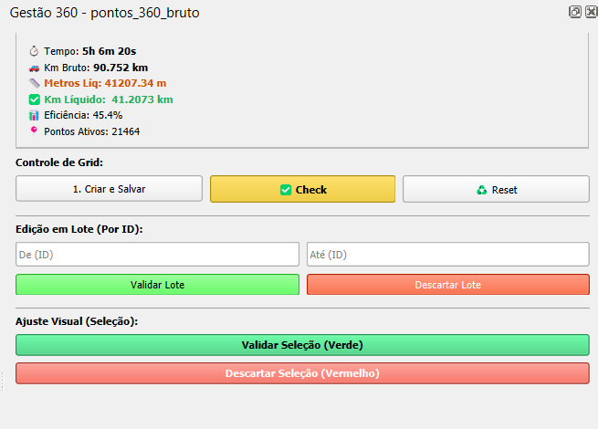

# 🌍 Gestão 360 Workstation (QGIS Plugin Script)

Ferramenta avançada de auditoria e processamento de dados de imagens 360º (Street View) integrada ao QGIS. Desenvolvida para otimizar o fluxo de trabalho de mapeamento urbano, cálculo de quilometragem útil e eliminação de redundâncias em coletas de campo.

  

---

## 📸 Interface

*(Painel de controle integrado ao QGIS)*

---

## 🚀 Funcionalidades Principais

* **Algoritmo de Quilometragem Líquida:** Calcula a extensão útil mapeada, descontando sobreposições e paradas.
* **Workstation Interativa:** Painel lateral (DockWidget) integrado à interface do QGIS.
* **Controle por Grid Persistente:** Geração de grids de 250m² salvos em GeoPackage (`.gpkg`) para controle de progresso (Check/Uncheck).
* **Sistema Anti-Crash:** Validação prévia de geometria e CRS para evitar travamentos em grandes datasets.
* **Edição em Lote:** Filtros inteligentes por ID para remoção rápida de redundâncias (ex: paradas em semáforos).
* **Cache e Recuperação:** Sistema de memória e atalho (**F12**) para recuperação rápida da sessão de trabalho.

## ⚙️ Requisitos

* QGIS 3.10 ou superior.
* Bibliotecas Python padrão do QGIS (`PyQt5`, `qgis.core`, `qgis.gui`).
* Camada de Vias (Arruamento) carregada no projeto.

## 🛠️ Como Usar

1.  Abra o **Console Python** no QGIS (`Ctrl + Alt + P`).
2.  Carregue o script `gestao_360_v42.py` no editor.
3.  Execute o script (Botão Play verde).
4.  No diálogo que se abrir:
    * Selecione a camada de pontos (fotos).
    * (Opcional) Selecione os arquivos `.gpx` originais para cálculo de tempo.
5.  Utilize o painel lateral para auditar os dados.

## 📸 Fluxo de Trabalho

1.  **Rodagem:** Coleta de dados em campo.
2.  **Processamento:** Mosaic Processor (Geração de JPG + GPX).
3.  **Auditoria (Este Script):**
    * Geração automática de IDs sequenciais.
    * Criação de Grid de Controle.
    * Validação visual e limpeza de dados redundantes.
    * Exportação de métricas finais.

## 📄 Licença

Este projeto está sob a licença MIT - sinta-se livre para usar, modificar e contribuir.

---
**Desenvolvido por:** [Jordy/TecGeo]
